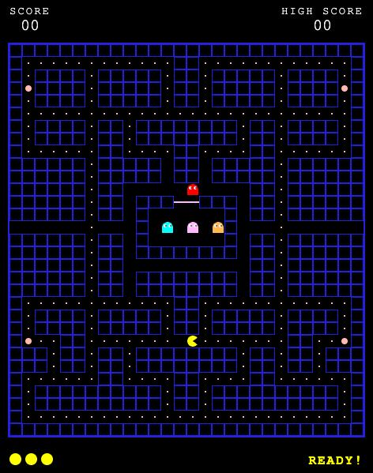

# Pac-Man Clone (Vanilla JS)

En autentisk Pac-Man-klone bygget med HTML5 Canvas og JavaScript, utviklet for å etterligne den klassiske arkadeopplevelsen fra 1980.

## Bakgrunn og Research
For å sikre en mest mulig tro kopi av originalen, er spillet utviklet basert på spesifikasjoner fra *The Pac-Man Dossier*. Følgende kjerneelementer er implementert:
- **Labyrint-presisjon:** Brettet følger den originale 28x31 rutenett-strukturen.
- **Mekanikk for Power Pellets:** Implementert "Frightened Mode" hvor spøkelsene snur retning, endrer farge til blått, og blir spiselige i en tidsbegrenset periode.
- **Poengberegning:** Korrekt poenggivning for prikker (10p), Power Pellets (50p) og spising av spøkelser (200p).

## Nøkkelfunksjonalitet
- **Prosedyrelyd (Web Audio API):** Alle lydeffekter (Waka-Waka, sirene, død, spising av spøkelser) genereres i sanntid uten bruk av eksterne lydfiler, noe som sikrer en sømløs retro-opplevelse.
- **Spøkelses-AI:** Fire distinkte spøkelser (Blinky, Pinky, Inky og Clyde) med logikk for kollisjonsdeteksjon og tunnel-effekt.
- **Liv-system:** Spilleren starter med 3 liv, med visuell indikator i UI og logikk for å nullstille posisjoner ved tap av liv.
- **Spillstatus:** Håndtering av "READY!", "GAME OVER" og "YOU WIN!" (når alle prikker er spist).
- **Ytelse:** Bruker `requestAnimationFrame` for 60 FPS flyt og pixel-perfect gjengivelse.

## Hvordan spille
1. Åpne `index.html` i en moderne nettleser.
2. Trykk på en piltast for å aktivere lyd og starte spillet.
3. Bruk piltastene for å styre Pac-Man gjennom labyrinten.

## Teknisk
- **HTML5 Canvas:** For rendering av grafikk.
- **CSS3:** For arkade-inspirert styling og responsiv layout.
- **Vanilla JavaScript:** All logikk er skrevet i ren JS uten eksterne biblioteker for maksimal sikkerhet og ytelse.

## Agentisk KI
- **Gemini CLI** for agentisk KI (med `/plan` mode initielt). Også benyttet for generering og videre forvaltning av denne README-filen.
